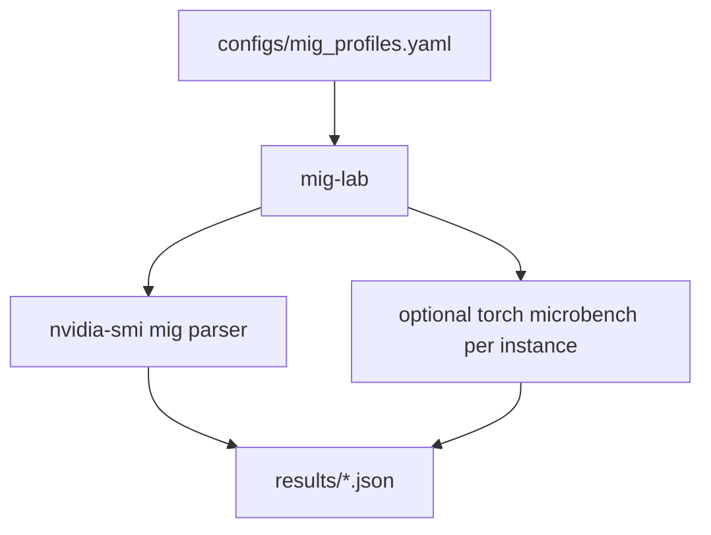

# mig-performance-lab

**One-line problem statement:** Compares **NVIDIA MIG** (Multi-Instance GPU) **profile** tradeoffs in **isolation**, **memory**, and **effective throughput**, using **structured configs** and **repeatable** `nvidia-smi` snapshots plus optional **PyTorch** micro-loads.

---

## Why this exists

**MIG** is how datacenters **slice** an A100/H100-class GPU for **multi-tenant** isolation.

---

## Architecture



---

## Benchmark methodology

1. **Capture topology**: `mig-lab status` dumps **GPU UUID**, **MIG devices**, **placement**.
2. **Micro-load**: Optional FP32 GEMM on a **single MIG compute instance** (when CUDA visible device is set to that instance).
3. **Compare**: Record **throughput** and **power** vs **full GPU** baseline on the same node.

**Caveats:** MIG **must** be enabled in **BIOS/driver**; profiles are **SKU-specific**.

---

## Reproducible commands

```bash
pip install -e ".[dev]"

# Parse MIG layout (no admin actions)
mig-lab status --json-out results/mig_status.json

# Document a profile matrix (edit configs/mig_profiles.yaml first)
mig-lab describe-profiles
```

---

## Metrics table (example)

| Profile | Memory (GB) | Isolation | Relative GEMM (illustrative) |
|---------|-------------|-----------|----------------------------|
| 1g.10gb | ~10 | High | 0.11× |
| 3g.40gb | ~40 | Medium | 0.35× |


---

## What I learned

- **MIG is not free**: Throughput per instance roughly tracks **SM partition**, but **memory bandwidth** and **scheduling** add nuance.
- **Ops complexity**: **Kubernetes** + MIG requires **device plugin** alignment; this lab helps **debug** wrong **profile** selection.

---

## Production relevance

- **Multi-tenant inference** clusters: **SLO per tenant** without **full GPU** per user.
- **Chargeback**: **GPU slice** accounting.

---

## Repo layout

```
├── configs/mig_profiles.yaml
├── src/mig_lab/
│   ├── cli.py
│   └── nvidia_mig.py
├── tests/
└── results/sample_mig_status.json
```

## License

MIT
